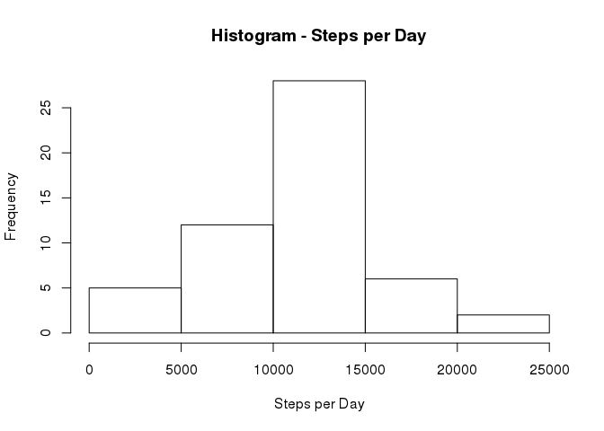
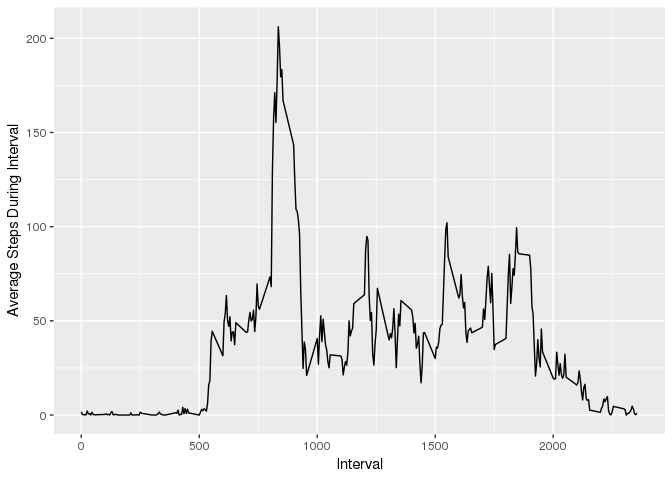
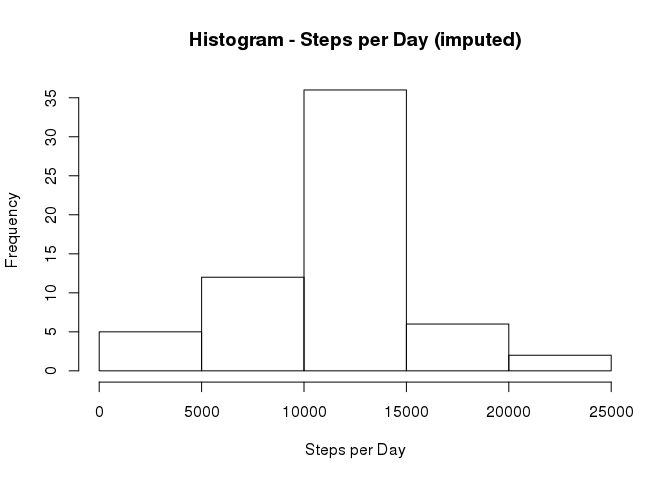
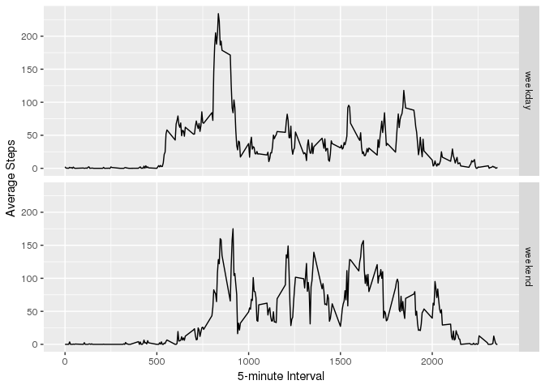

## Loading and preprocessing the data
Show any code that is needed to

1. Load the data (i.e. read.csv())

```r
file <- unzip("activity.zip")
activities <- read.csv("activity.csv")
```
2. Process/transform the data (if necessary) into a format suitable for your 
analysis

*Add column with dates converted into POSIXlt format to answer weekday question.*

```r
library(lubridate)
```

```
## 
## Attaching package: 'lubridate'
```

```
## The following object is masked from 'package:base':
## 
##     date
```

```r
activities$date_converted <- as.Date(activities$date, "%Y-%m-%d")
```

## What is mean total number of steps taken per day?
For this part of the assignment, you can ignore the missing values in the dataset.

1. Make a histogram of the total number of steps taken each day

```r
library(xtable)
library(dplyr)
```

```
## 
## Attaching package: 'dplyr'
```

```
## The following objects are masked from 'package:lubridate':
## 
##     intersect, setdiff, union
```

```
## The following objects are masked from 'package:stats':
## 
##     filter, lag
```

```
## The following objects are masked from 'package:base':
## 
##     intersect, setdiff, setequal, union
```

```r
total_steps_per_day <- activities %>% select(date, steps) %>% 
                                          filter(!is.na(steps)) %>%
                                          group_by(date) %>%
                                          summarize(total_steps = sum(steps))

hist(total_steps_per_day$total_steps,
     xlab = "Steps per Day",
     main = "Histogram - Steps per Day")
```

<!-- -->

2. Calculate and report the mean and median total number of steps taken per day

```r
#Format with 4 decimal places
median_daily_steps <- median(total_steps_per_day$total_steps, na.rm = TRUE)
median_daily_steps <- sprintf("%.4f", median_daily_steps)

mean_daily_steps <- mean(total_steps_per_day$total_steps, na.rm = TRUE)
mean_daily_steps <- sprintf("%.4f", mean_daily_steps)
```

*The **mean** of the total number of steps taken per day is **10766.1887**.*

*The **median** of the total number of steps taken per day is **10765.0000**.*

## What is the average daily activity pattern?
1. Make a time series plot (i.e. type = "l") of the 5-minute interval (x-axis) and the average number of steps taken, averaged across all days (y-axis)

```r
library(ggplot2)

average_interval <- activities %>% select(interval, steps) %>% group_by(interval) %>% dplyr::summarize(avg_steps = mean(steps, na.rm = TRUE))

qplot(interval, avg_steps, 
                  data = average_interval, 
                  geom = "line",
                  xlab = "Interval",
                  ylab = "Average Steps During Interval")
```

<!-- -->

2. Which 5-minute interval, on average across all the days in the dataset, contains the maximum number of steps?

```r
max_interval <- average_interval[average_interval$avg_steps == max(average_interval$avg_steps), 1]
```

*On average across all the days in the dataset, the 5-minute interval which contains the maximum number of steps is interval **#835**.*

## Imputing missing values
Note that there are a number of days/intervals where there are missing values (coded as NA). The presence of missing days may introduce bias into some calculations or summaries of the data.

1. Calculate and report the total number of missing values in the dataset (i.e. the total number of rows with NAs)

```r
total_rows_with_NA <- sum(is.na(activities$steps))
```
*The total number of rows with NAs is **2304**.*

2. Devise a strategy for filling in all of the missing values in the dataset. The strategy does not need to be sophisticated. For example, you could use the mean/median for that day, or the mean for that 5-minute interval, etc.

*The strategy will be to calculate the mean per interval to replace NA valus.*

3. Create a new dataset that is equal to the original dataset but with the 
missing data filled in.

```r
library(Hmisc)
```

```
## Loading required package: lattice
```

```
## Loading required package: survival
```

```
## Loading required package: Formula
```

```
## 
## Attaching package: 'Hmisc'
```

```
## The following objects are masked from 'package:dplyr':
## 
##     src, summarize
```

```
## The following objects are masked from 'package:xtable':
## 
##     label, label<-
```

```
## The following objects are masked from 'package:base':
## 
##     format.pval, units
```

```r
library(plyr)
```

```
## -------------------------------------------------------------------------
```

```
## You have loaded plyr after dplyr - this is likely to cause problems.
## If you need functions from both plyr and dplyr, please load plyr first, then dplyr:
## library(plyr); library(dplyr)
```

```
## -------------------------------------------------------------------------
```

```
## 
## Attaching package: 'plyr'
```

```
## The following objects are masked from 'package:Hmisc':
## 
##     is.discrete, summarize
```

```
## The following objects are masked from 'package:dplyr':
## 
##     arrange, count, desc, failwith, id, mutate, rename, summarise,
##     summarize
```

```
## The following object is masked from 'package:lubridate':
## 
##     here
```

```r
imputed_activities <- ddply(activities, "interval", mutate, steps = impute(steps, mean, na.rm = TRUE))

#Must detach the Hmisc library because it masks the 'summarize' function in dplyr
detach("package:Hmisc", unload=TRUE)
```

4. Make a histogram of the total number of steps taken each day and Calculate and report the mean and median total number of steps taken per day. Do these values differ from the estimates from the first part of the assignment? What is the impact of imputing missing data on the estimates of the total daily number of steps?

```r
library(xtable)
library(dplyr)

total_steps_per_day_imputed <- imputed_activities %>% select(date, steps) %>% 
                                          filter(!is.na(steps)) %>%
                                          group_by(date) %>%
                                          dplyr::summarize(total_steps = sum(steps))

hist(total_steps_per_day_imputed$total_steps,
     xlab = "Steps per Day",
     main = "Histogram - Steps per Day (imputed)")
```

<!-- -->

```r
#Format output with 4 decimal places
median_daily_steps_imputed <- median(total_steps_per_day_imputed$total_steps, 
                                     na.rm = TRUE)
median_daily_steps_imputed <- sprintf("%.4f", median_daily_steps_imputed)

mean_daily_steps_imputed <- mean(total_steps_per_day_imputed$total_steps, 
                                 na.rm = TRUE)
mean_daily_steps_imputed <- sprintf("%.4f", mean_daily_steps_imputed)
```

*The **mean** of the **imputed** total number of steps taken per day is **10766.1887**.*

*The **median** of the **imputed** total number of steps taken per day is **10766.1887**.*

*The mean and median of the imputed data are similar to the
non-imputed data.*

## Are there differences in activity patterns between weekdays and weekends?
For this part the weekdays() function may be of some help here. Use the dataset 
with the filled-in missing values for this part.

1. Create a new factor variable in the dataset with two levels – “weekday” and 
“weekend” indicating whether a given date is a weekday or weekend day.

```r
activities$day_type <- as.factor(
                              ifelse(
                                    wday(activities$date_converted) 
                                          %in% c(1,7), "weekend", "weekday"))
```

2. Make a panel plot containing a time series plot (i.e. type="l") of the 
5-minute interval (x-axis) and the average number of steps taken, averaged 
across all weekday days or weekend days (y-axis). See the README file in the 
GitHub repository to see an example of what this plot should look like using 
simulated data.

```r
avg_steps_per_interval <- activities %>%  arrange(interval, day_type) %>% 
                                          select(interval, steps, day_type) %>% 
                                          filter(!is.na(steps)) %>%
                                          group_by(interval, day_type) %>%
                                          dplyr::summarize(avg_steps = mean(steps))

qplot(interval, avg_steps, 
                  data = avg_steps_per_interval, 
                  geom = "line",
                  xlab = "5-minute Interval",
                  ylab = "Average Steps") + facet_grid(day_type ~ .)
```

<!-- -->


